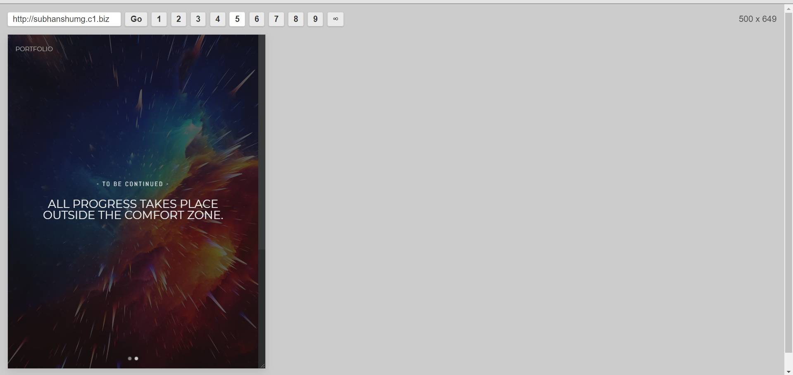
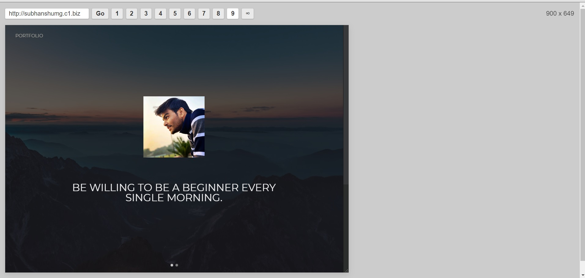
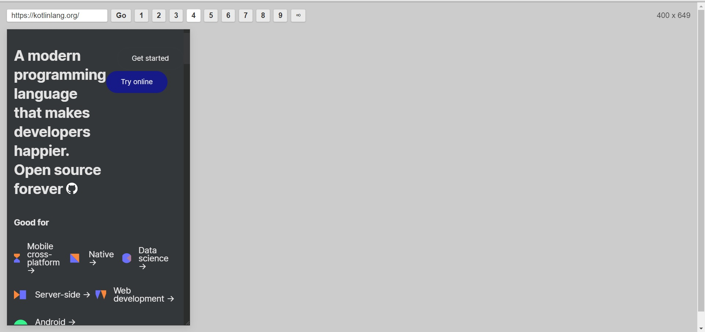
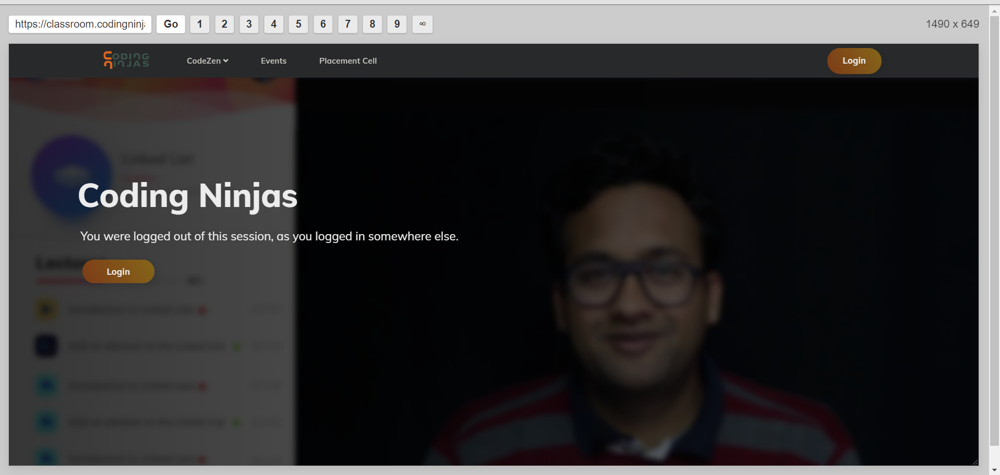

# WebRES
 WebRES is an HTML5 app that lets you test websites at a variety of resolutions very quickly.  It also works on mobile, which allows you to test websites at a variety of widths on a phone or tablet where you can't normally change the width of the browser.

Here are some screenshots:

 
 
 
 
 
 
 
